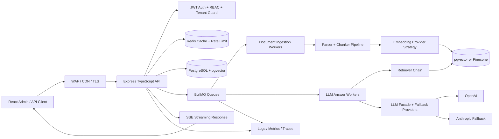
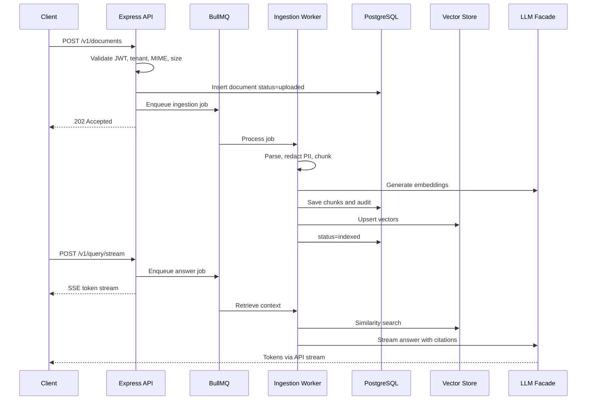

# A. System Design

## 1. High-Level Architecture Diagram

## 2. Component Breakdown

| Component | Responsibility | Boundary |
|---|---|---|
| React Admin | Upload documents, manage workspaces, ask questions | UI only; no direct DB or provider access |
| Express API | REST contracts, validation, auth, tenancy, streaming | Thin orchestration layer |
| Auth/RBAC | JWT verification, tenant isolation, role checks | Rejects cross-tenant access before service calls |
| Ingestion Pipeline | Parse, normalize, chunk, embed, index | Async worker; idempotent per checksum |
| Retrieval Chain | Query rewrite, embedding, vector search, rerank, cite | Provider-independent retrieval logic |
| LLM Facade | Provider fallback, caching, budgets, retries | Hides OpenAI/Anthropic specifics |
| Repositories | PostgreSQL and vector persistence | Interfaces enable mocks and provider swaps |
| Redis | cache, idempotency locks, rate limits, BullMQ | Volatile operational state |
| PostgreSQL + pgvector | durable metadata, audit logs, chunks, vectors | Source of truth |
| Observability | logs, traces, metrics, alerts | No business logic |

## 3. Data Flow Diagram

## 4. AI/LLM Integration Architecture

LLM calls sit behind `src/infrastructure/llm/llm-facade.ts`. Embedding runs asynchronously inside ingestion workers; answer generation is queued and streamed so the API hot path does not block on provider latency. Redis caches deterministic prompt/context pairs, token budget policy protects tenants, and fallback providers mirror Chargezoom-style gateway abstraction: one domain contract, multiple external adapters.

## 5. Database Schema Design

| Table | Key Fields | Indexes / Relationships |
|---|---|---|
| tenants | id uuid pk, slug text unique, plan, monthly_token_budget | unique(slug) |
| users | id uuid pk, tenant_id fk, email citext, role enum | unique(tenant_id,email), index tenant_id |
| documents | id uuid pk, tenant_id fk, title, mime_type, checksum_sha256, status, source_uri, created_by | unique(tenant_id,checksum_sha256), index status |
| document_chunks | id uuid pk, document_id fk, tenant_id fk, ordinal int, content text, token_count int, metadata jsonb | unique(document_id,ordinal), GIN(metadata) |
| embeddings | chunk_id uuid pk fk, tenant_id fk, embedding vector(3072), model text | ivfflat/hnsw vector index, index tenant_id |
| conversations | id uuid pk, tenant_id fk, user_id fk, title | index tenant_id,user_id |
| messages | id uuid pk, conversation_id fk, role, content, token_count | index conversation_id,created_at |
| llm_usage | id uuid pk, tenant_id fk, user_id fk, provider, model, input_tokens, output_tokens, cost_usd | index tenant_id,created_at |
| audit_events | id uuid pk, tenant_id fk, actor_id, action, resource_type, resource_id, metadata jsonb | index tenant_id,created_at |
| api_keys | id uuid pk, tenant_id fk, key_hash, scopes text[], expires_at | unique key_hash |

## 6. API Contract Overview

REST is primary because it is easy to secure, document, and consume across portfolio demos.

| Endpoint | Purpose |
|---|---|
| POST `/v1/auth/token` | issue JWT for demo or service account |
| POST `/v1/documents` | upload/register document |
| GET `/v1/documents` | list tenant documents |
| GET `/v1/documents/{id}` | fetch document metadata |
| DELETE `/v1/documents/{id}` | soft delete and remove vectors |
| POST `/v1/query` | non-streaming answer with citations |
| POST `/v1/query/stream` | SSE streaming answer |
| GET `/v1/usage` | tenant/user token and cost usage |
| GET `/health/live`, `/health/ready` | probes |

## 7. Scalability Strategy

The API is stateless and horizontally scalable behind a load balancer. Ingestion and LLM workers scale separately by queue depth. Redis handles rate limits, prompt cache, and idempotency locks. PostgreSQL read replicas serve listing/reporting queries; vector search can start with pgvector and move to Pinecone for high-cardinality workloads without changing service contracts.

## 8. Security Architecture

JWTs carry `tenant_id`, `sub`, `role`, and scoped permissions. RBAC: Owner manages tenant and billing; Admin manages users/documents; Engineer ingests and queries; Viewer queries only; ServiceAccount uses scoped API keys. All tenant filters are enforced in repositories, not only controllers, echoing BookMyStylist-style tenant isolation. TLS is required, KMS encrypts secrets and backups, Redis and Postgres require auth, uploads are MIME-sniffed and size-limited, all input is Zod-validated, rate limits are per tenant/user/IP, and errors use RFC 7807 without leaking provider payloads.

## 9. Failure Mode Analysis

| Scenario | Impact | Mitigation |
|---|---|---|
| LLM provider outage | answers fail or degrade | fallback provider, circuit breaker, cached answers |
| Vector DB slow query | high latency | topK caps, filters, HNSW/IVFFlat indexes, timeout |
| Duplicate ingestion | wasted cost | checksum uniqueness and Redis idempotency lock |
| Prompt injection in documents | unsafe output | context delimiting, instruction hierarchy, citation requirement |
| Tenant budget exhaustion | surprise cost | hard caps, usage ledger, 402/429 problem responses |

## 10. Trade-Off Decisions

1. `pgvector` first, Pinecone-compatible interface later: simpler local development and transactional chunk metadata; Pinecone wins at extreme scale but adds vendor cost.
2. REST plus SSE over GraphQL subscriptions: easier OpenAPI, proxies, and recruiter review; GraphQL is attractive for admin UI composition but less necessary for streaming RAG.
3. Queue-first LLM architecture: more moving parts than direct calls, but protects latency, retries safely, and demonstrates production thinking for fintech-grade workloads.
